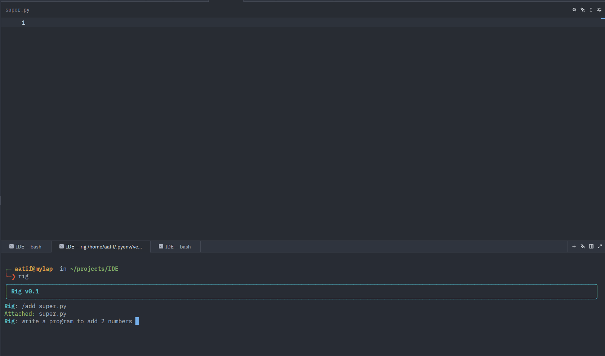
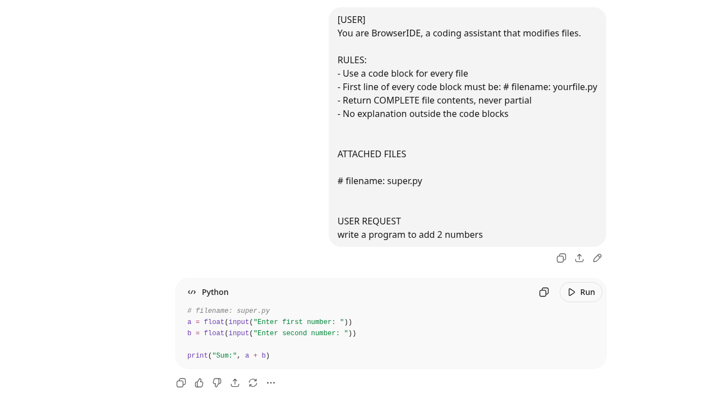
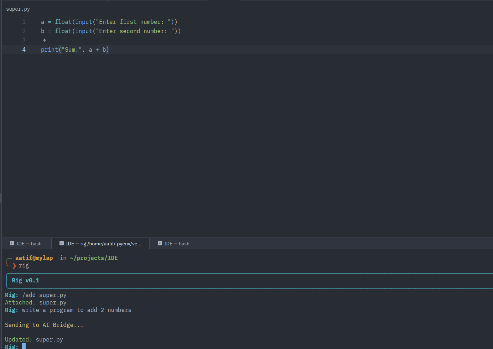

# Rig

**AI IDE with NO API KEY — runs through ChatGPT web directly.**

No subscriptions. No API costs. No black box. You rig it.

---

## Philosophy

Every other AI IDE hides what's happening between you and the model. Rig doesn't. See every send, every receive, every file the AI touched.

Lightweight. Transparent. Yours to extend.

*You don't use Rig — you rig it.*

---

## Demo

### 1. Send a prompt



### 2. ChatGPT processes the request



### 3. File updated


---

## Current Scope

Rig v0.1 is a proof of concept focused on validating the workflow and architecture.

It is not yet a standalone editor.

Rig is designed to be used alongside your existing editor (Zed, VS Code, Neovim, etc.), where you edit code normally and use Rig from the terminal to interact with AI.

The goal of v0.1 is to prove:

* AI-powered file editing
* Transparent AI workflows
* Browser-based ChatGPT integration
* The Rig ↔ AI Bridge architecture

Future versions will evolve into a standalone terminal-based IDE with dedicated panels, logs, project maps, context management, and integrated AI workflows.

---
## How it works

Rig routes your code through ChatGPT's web interface using a browser bridge. No API key. No cost. Just sign in with your ChatGPT account and start coding.

> ⚠️ Each message starts a new session. ChatGPT has no memory of your previous messages — keep that in mind when writing prompts.

---

## Install

## Installation

```bash
git clone https://github.com/AatifLabs/Rig

cd Rig

pip install -e .
```

---

## Commands

| Command | What it does |
|---|---|
| `aibridge` | Opens browser → sign into ChatGPT |
| `rig` | Starts the IDE (run this after aibridge) |
| `stopbridge` | Kills the bridge process |

---

## Quickstart

**1. Start the bridge**
```bash
aibridge
```
A browser window opens. Sign into ChatGPT with your account (burner or normal).

**2. Start Rig**
```bash
rig
```
Only run this after `aibridge` is connected.

**3. Add files to context**
```bash
/add hi.py
```
For multiple files:
```bash
/add hi.py hello.py
```

**4. Send your message**

Type your prompt and send. Rig routes it to ChatGPT and writes the response directly into your file.

---

## Important: How file editing works

- **Full file replace** — Rig doesn't do search/replace. When AI edits a file, it rewrites the whole file.
- **Rig does not ask before writing** — control is via prompt. If you have multiple files added, explicitly tell the AI which file to edit, otherwise it may rewrite all of them.
- **You must `/add` a file before sending any message.** Sending without a file won't work.
- **Flat files only, main directory only** — `/add hi.py` works. Nested paths won't work in this version.
- **Added files persist across messages** — whatever you `/add` stays in context for the next query too. `/drop` coming in next version.

---

## If something goes wrong

Bridge acting up? Kill it and restart:
```bash
stopbridge
aibridge
```

---

## Current version — what works

- `/add` one or multiple files to context
- AI reads files, writes files, creates new files
- Full file replace — control via prompt, no confirmation dialog
- Transparent send/receive — see exactly what's going out and coming back

## Coming next

- `/ask` — chat with your codebase without editing files
- `/drop` — remove files from context
- `/context` — dump all files for full brute force context
- TUI with independent panels — logs, files, AI requests, all live
- Pull method — AI requests files instead of you sending them
- Multi-model support
